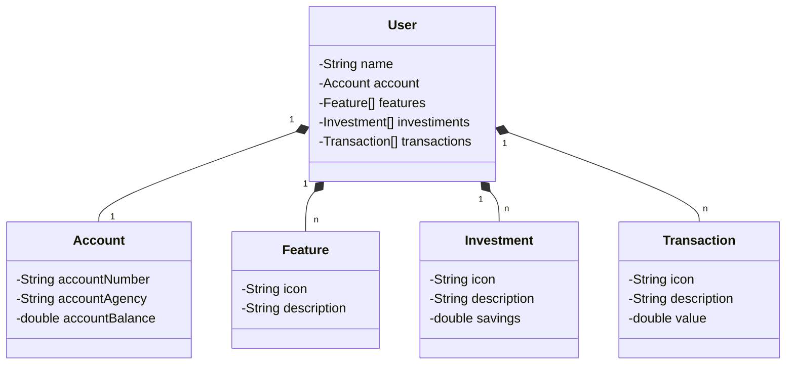

# Desafio Claro - Java com Spring Boot DIO
Desafio de banco de dados Postgres em Java RESTful API

## Diagrama de classes

```mermaid
classDiagram
    class User {
        -String name
        -Account account
        -Feature[] features
        -Investment[] investiments
        -Transaction[] transactions
    }

    class Account {
        -String accountNumber
        -String accountAgency
        -double accountBalance
    }

    class Feature {
        -String icon
        -String description
    }

    class Investment {
        -String icon
        -String description
        -double savings
    }

    class Transaction {
        -String icon
        -String description
        -double value
    }

    User "1" *-- "1" Account
    User "1" *-- "n" Feature
    User "1" *-- "n" Investment
    User "1" *-- "n" Transaction
```
